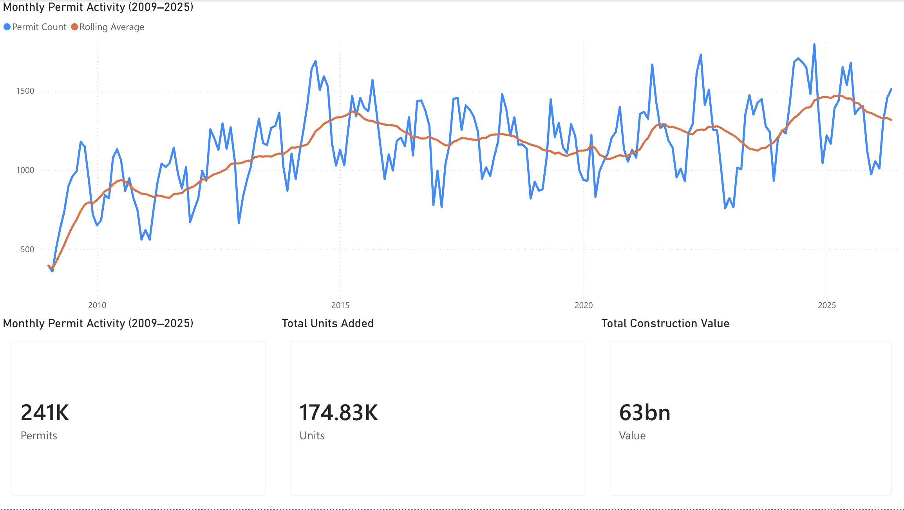
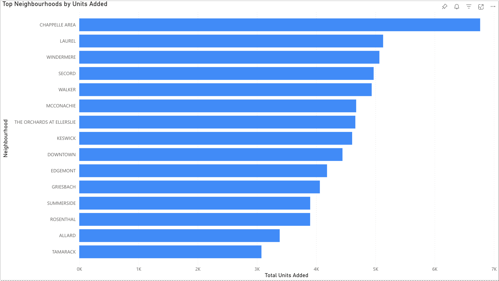
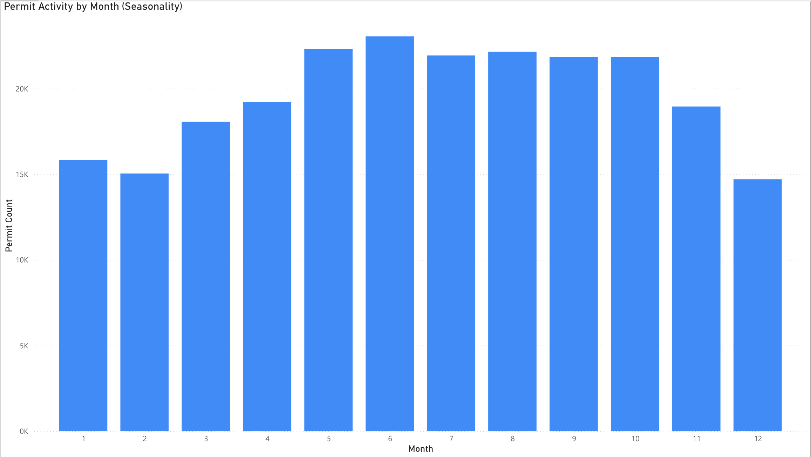
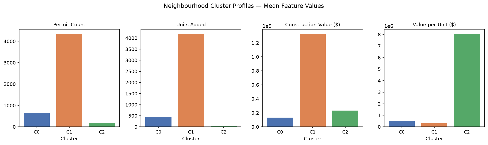
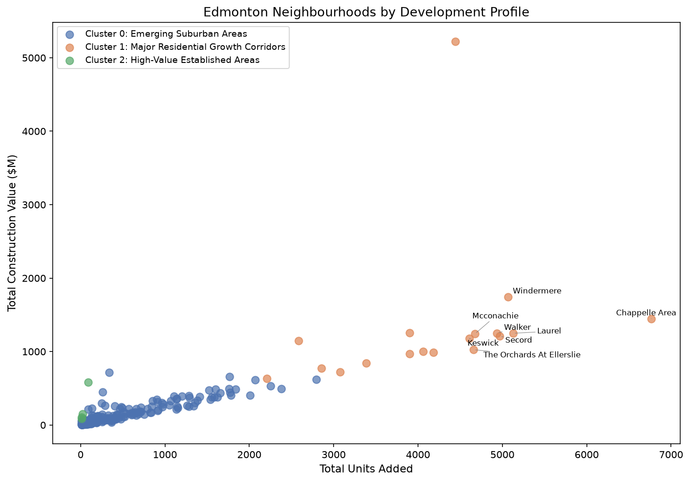

# Edmonton Construction & Housing Activity Intelligence

## Project Overview

This project analyzes over 240,000 building permit records from the City of Edmonton Open Data Portal to identify long-term housing development trends, construction activity patterns, permit seasonality, and neighbourhood growth hotspots.

The project demonstrates a complete analytics workflow: data extraction from a public API, cleaning and standardization, SQL-based analysis, unsupervised machine learning, Python visualization, and an interactive Power BI dashboard.

---

## Key Takeaways for Construction Planners

Edmonton's construction activity has grown 72% since 2009, with housing unit creation nearly quadrupling. Permit volume peaks sharply in June and stays elevated through September, making summer the critical window for resource planning. Growth is heavily concentrated in a small set of suburban corridors: Chappelle Area, Laurel, Windermere, Secord, and Walker account for a disproportionate share of new units added, while established inner-city areas like Oliver show high construction value per project with minimal unit growth, indicating a different type of development activity entirely.

---

## Dashboard

An interactive Power BI dashboard was built on top of the SQL export pipeline, providing three report pages.

### Overview


Monthly permit activity from 2009 to 2025 with a 12-month rolling average, alongside headline KPIs: 241K total permits, 174K units added, and $63B in total construction value.

### Neighbourhoods


Top 15 neighbourhoods by housing units added, showing that growth is concentrated in newer suburban corridors.

### Permit Activity


Seasonal permit distribution by calendar month alongside a permit type breakdown, confirming a strong summer peak and the dominance of new construction permits.

---

## Dataset

**Source:** City of Edmonton Open Data — Building Permits Dataset
https://data.edmonton.ca/

- 241,921 permit records
- 2009 to 2026 permit activity
- Construction values, housing unit additions, neighbourhood info, permit classifications, geographic coordinates

---

## Technology Stack

| Layer | Tools |
|---|---|
| Data Engineering | Python, pandas, requests |
| Data Storage | SQLite |
| Data Analysis | SQL, pandas |
| Machine Learning | scikit-learn (K-means clustering) |
| Visualization | matplotlib, Jupyter Notebook |
| Business Intelligence | Power BI |

---

## Project Workflow

**1. Data Extraction** — Building permit records collected from the Edmonton Open Data API using automated pagination.

**2. Data Profiling** — Missing value analysis, column inspection, data type validation.

**3. Data Cleaning** — Raw fields standardized into analytics-ready columns: `permit_date`, `permit_type_std`, `neighbourhood_std`, `construction_value_num`, `units_added_num`.

**4. SQL Analytics** — Core analysis in SQLite covering annual and monthly trends, seasonality, neighbourhood growth, permit type breakdown, YoY comparisons, and rolling averages using window functions.

**5. Neighbourhood Clustering** — K-means clustering on permit volume, units added, construction value, and value per unit to group neighbourhoods by development profile.

**6. Dashboard Export Pipeline** — Summary tables exported to CSV and loaded into Power BI for interactive reporting.

---

## Key Findings

### 1. Long-Term Construction Growth

| Year | Permit Count | Units Added | Construction Value |
|--------|--------:|--------:|--------:|
| 2009 | 9,471 | 4,545 | $2.39B |
| 2025 | 16,313 | 17,285 | $5.06B |

Permit volume grew 72%, housing unit creation nearly quadrupled, and construction value more than doubled over the study period.

---

### 2. Strong Recovery After 2020

Monthly permit activity softened during the late 2010s before recovering sharply around 2021. The 12-month rolling average reached its highest levels in 2024 to 2025, indicating a renewed development cycle.

---

### 3. New Construction Dominates

The two primary new-construction permit categories account for over 100,000 permits and 175,000 housing units added. Edmonton's housing growth is driven by new builds rather than conversions or additions, though interior alterations represent $7.1B in construction value, indicating significant parallel investment in existing building stock.

---

### 4. Demolition Supports Redevelopment

9,751 demolition permits resulted in a net removal of approximately 5,900 units, typically preceding higher-density replacement development.

---

### 5. Growth Is Concentrated in Suburban Corridors

Chappelle Area, Laurel, Windermere, Secord, and Walker lead all neighbourhoods by units added. These are newer suburban expansion areas on the city's fringe with large-scale residential pipelines.

---

### 6. Strong Seasonal Pattern

June consistently produces the highest permit volume (approximately 23,000) while February produces the lowest (approximately 15,000), closely tracking Edmonton's construction season.

---

### 7. Neighbourhood Clustering by Development Profile

K-means clustering (k=3, silhouette score: 0.773) grouped Edmonton's 246 active residential neighbourhoods into three distinct development profiles.





| Cluster | Label | Characteristics | Example Neighbourhoods |
|---|---|---|---|
| 0 | Emerging Suburban Areas | Moderate permits and units, affordable construction value per unit | Maple, The Uplands, Crystallina Nera West |
| 1 | Major Residential Growth Corridors | Highest volume across all metrics, dominant housing supply contributors | Chappelle Area, Laurel, Windermere, Secord, Walker |
| 2 | High-Value Established Areas | Low permit volume, few units added, but $8M average construction value per unit, indicating infill, commercial conversion, or high-end redevelopment | Goodridge Corners, West Meadowlark Park, Kennedale Industrial |

The cluster assignments are exported to `data/exports/neighbourhood_clusters.csv` for further analysis or dashboard integration.

---

## SQL Highlights

The core analysis (`sql/01_core_analysis.sql`) includes:

- Partial-year exclusion using CTEs to avoid misleading YoY comparisons
- `LAG()` window function for month-over-month change
- Rolling 12-month average using `AVG() OVER (ROWS BETWEEN 11 PRECEDING AND CURRENT ROW)`
- Neighbourhood YoY growth with `CROSS JOIN` to the latest complete year

---

## Repository Structure

```text
edmonton-construction-analytics/
├── data/
│   ├── raw/
│   ├── processed/
│   └── exports/
├── docs/
│   └── figures/
├── notebooks/
├── sql/
│   └── 01_core_analysis.sql
├── src/
│   ├── 01_extract_permits.py
│   ├── 02_inspect_raw.py
│   ├── 03_clean_permits.py
│   ├── 04_load_sqlite.py
│   ├── 05_export_dashboard_tables.py
│   ├── 06_make_eda_charts.py
│   └── 07_neighbourhood_clustering.py
├── requirements.txt
└── README.md
```

---

## Author

Peter Davidson — Data Analytics Portfolio Project