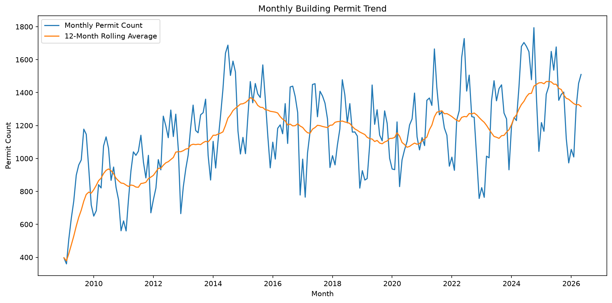
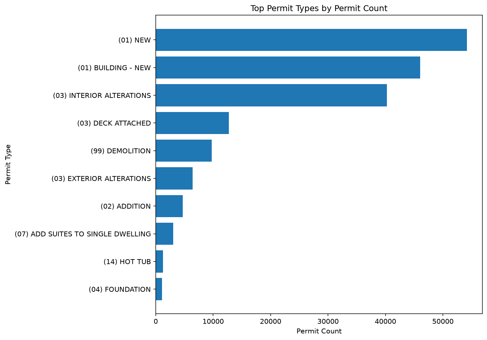
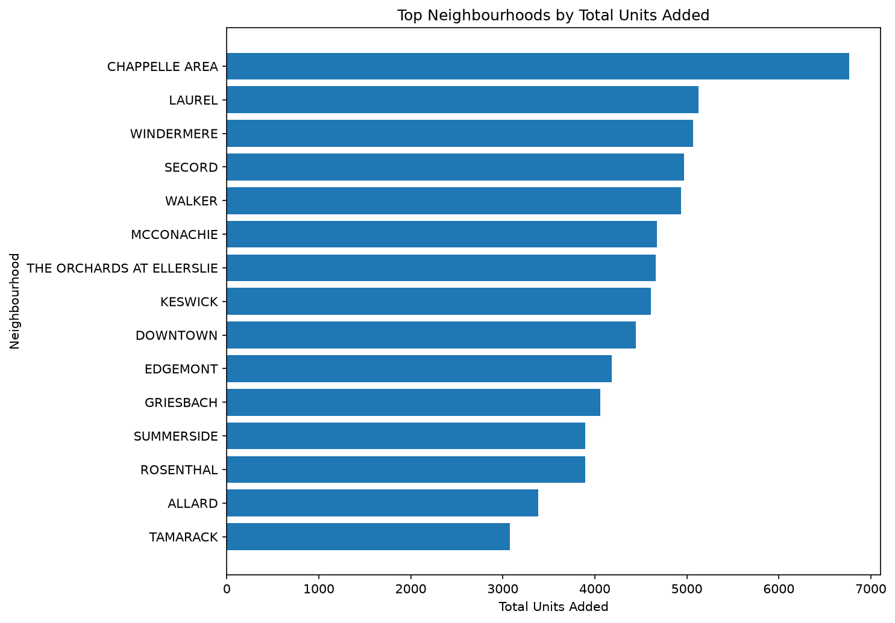
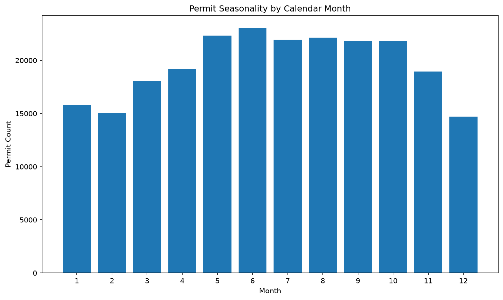

# Edmonton Construction & Housing Activity Intelligence

## Project Overview

This project analyzes over 240,000 building permit records from the City of Edmonton Open Data Portal to identify long-term housing development trends, construction activity patterns, permit seasonality, and neighbourhood growth hotspots.

The project demonstrates a complete analytics workflow:

- Data extraction from a public API
- Data cleaning and standardization
- SQL-based exploratory analysis
- Time-series trend analysis
- Data visualization with Python
- Dashboard-ready export generation

## Business Problem

Municipal governments, developers, investors, and urban planners all need to understand:

- Where housing growth is occurring
- Which neighbourhoods are expanding fastest
- How construction activity changes over time
- Whether permit activity follows predictable seasonal patterns
- Which permit categories contribute most to housing supply

Using Edmonton building permit data, this project develops a repeatable analytics pipeline to answer those questions.

---

## Dataset

Source:

City of Edmonton Open Data

Building Permits Dataset

https://data.edmonton.ca/

Dataset coverage:

- 241,921 permit records
- 2009–2026 permit activity
- Construction values
- Housing unit additions
- Neighbourhood information
- Permit classifications
- Geographic coordinates

---

## Technology Stack

### Data Engineering

- Python
- pandas
- requests

### Data Storage

- SQLite

### Data Analysis

- SQL
- pandas

### Visualization

- matplotlib
- Jupyter Notebook

### Dashboard Preparation

- CSV export pipeline
- Power BI ready datasets

---

## Project Workflow

### 1. Data Extraction

Building permit records were collected from the Edmonton Open Data API using automated pagination.

Output:

- Raw permit dataset
- Column metadata documentation

### 2. Data Profiling

Initial data quality assessment included:

- Missing value analysis
- Column inspection
- Data type validation
- Unique value exploration

### 3. Data Cleaning

Permit records were standardized into analytics-friendly fields:

Examples:

- permit_date
- permit_type_std
- neighbourhood_std
- construction_value_num
- units_added_num

### 4. SQL Analytics

Analyses included:

- Annual permit trends
- Monthly permit trends
- Permit seasonality
- Neighbourhood growth analysis
- Permit type analysis
- Construction value trends

### 5. Dashboard Exports

Summary tables were generated for future dashboard integration:

- Monthly trends
- Neighbourhood summaries
- Permit type summaries
- Neighbourhood monthly activity

---

# Key Findings

## 1. Long-Term Construction Growth

Permit activity increased substantially over the study period.

| Year | Permit Count | Units Added | Construction Value |
|--------|--------:|--------:|--------:|
| 2009 | 9,471 | 4,545 | $2.39B |
| 2025 | 16,313 | 17,285 | $5.06B |

Key observations:

- Permit volume increased by approximately 72%.
- Housing unit creation nearly quadrupled.
- Construction value more than doubled.

This suggests sustained long-term growth in Edmonton's housing and construction sectors.

---

## 2. Strong Recovery After 2020

Monthly permit activity experienced slower growth between roughly 2015 and 2020 before accelerating again.

The 12-month rolling average shows:

- Softening activity during the late 2010s
- Recovery beginning around 2021
- Strong expansion during 2024–2025

### Monthly Permit Trend



The rolling average reached its highest levels during 2024 and 2025, indicating a renewed development cycle.

---

## 3. New Construction Dominates Development Activity

The largest permit categories were:

| Permit Type | Permit Count |
|------------|------------:|
| (01) NEW | 54,164 |
| (01) BUILDING - NEW | 46,036 |
| (03) INTERIOR ALTERATIONS | 40,270 |

Together, the two primary new-construction categories accounted for:

- More than 100,000 permits
- Over 175,000 housing units added

### Top Permit Types



This indicates that Edmonton's housing growth is driven primarily by new construction rather than conversions or additions.

---

## 4. Renovation Activity Remains Significant

Interior alteration permits accounted for over:

- 40,000 permits
- $7.1 billion in construction value

This highlights ongoing investment in existing building stock alongside new development.

---

## 5. Demolition Supports Redevelopment Cycles

Demolition permits accounted for:

- 9,751 permits
- Net removal of approximately 5,900 housing units

While demolitions reduce housing inventory in the short term, they often precede redevelopment and higher-density replacement projects.

---

## 6. Housing Growth Is Concentrated in Specific Neighbourhoods

The largest neighbourhoods by total units added were:

1. CHAPPELLE AREA
2. LAUREL
3. WINDERMERE
4. SECORD
5. WALKER

### Top Neighbourhoods by Units Added



These neighbourhoods represent major residential growth corridors within Edmonton.

Growth appears concentrated in newer suburban expansion areas where large-scale residential development continues.

---

## 7. Construction Activity Is Highly Seasonal

Permit issuance follows a clear annual cycle.

### Permit Seasonality



Key observations:

- Lowest activity occurs during winter months.
- Activity accelerates through spring.
- Permit issuance peaks during summer.
- Elevated activity continues through fall.

Permit counts by month:

| Month | Permit Count |
|--------|--------:|
| February | 15,041 |
| June | 23,049 |
| July | 21,932 |
| August | 22,148 |

June consistently produced the highest permit volume while February produced the lowest.

This pattern aligns closely with Edmonton's climate and construction season.

---

# Skills Demonstrated

This project demonstrates:

### Data Engineering

- API extraction
- Data ingestion
- ETL workflows
- Data cleaning

### SQL Analytics

- Aggregations
- Window functions
- Time-series analysis
- Trend calculations

### Python Analytics

- pandas
- matplotlib
- exploratory analysis

### Business Intelligence

- KPI generation
- dashboard-ready exports
- stakeholder-focused reporting

---

# Repository Structure

```text
edmonton_construction_analytics/

├── data/
│   ├── raw/
│   ├── processed/
│   └── exports/
│
├── docs/
│   ├── figures/
│   ├── raw_columns.txt
│   ├── raw_column_profile.csv
│   └── cleaned_data_dictionary.csv
│
├── notebooks/
│
├── sql/
│   └── 01_core_analysis.sql
│
├── src/
│   ├── 01_extract_permits.py
│   ├── 02_profile_raw_data.py
│   ├── 03_clean_permits.py
│   ├── 04_load_sqlite.py
│   └── 05_export_dashboard_tables.py
│
├── requirements.txt
└── README.md
```

# Future Enhancements

Planned next steps include:

- Interactive Power BI dashboard
- Geographic permit mapping
- Housing growth forecasting
- Neighbourhood growth scoring
- Census data integration
- Population-adjusted development metrics
- Automated data refresh pipeline

---

## Author

Peter Davidson

Data Analytics Portfolio Project

Focused on municipal development analytics, housing growth trends, and business intelligence workflows.